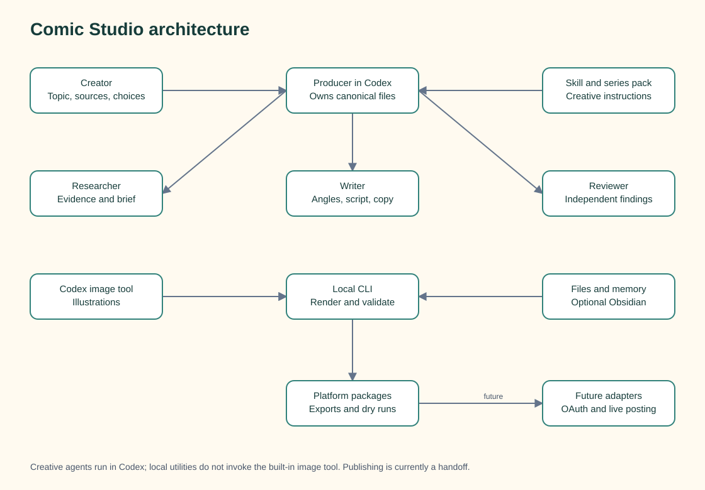
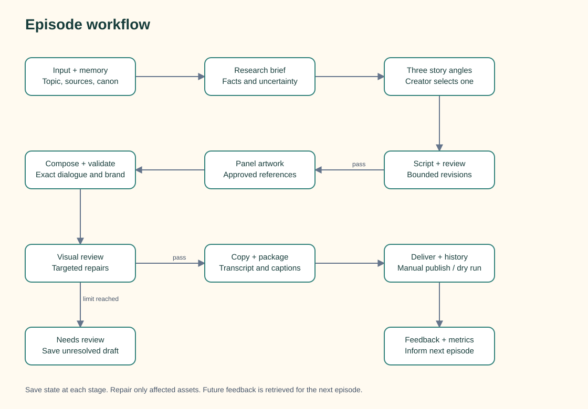
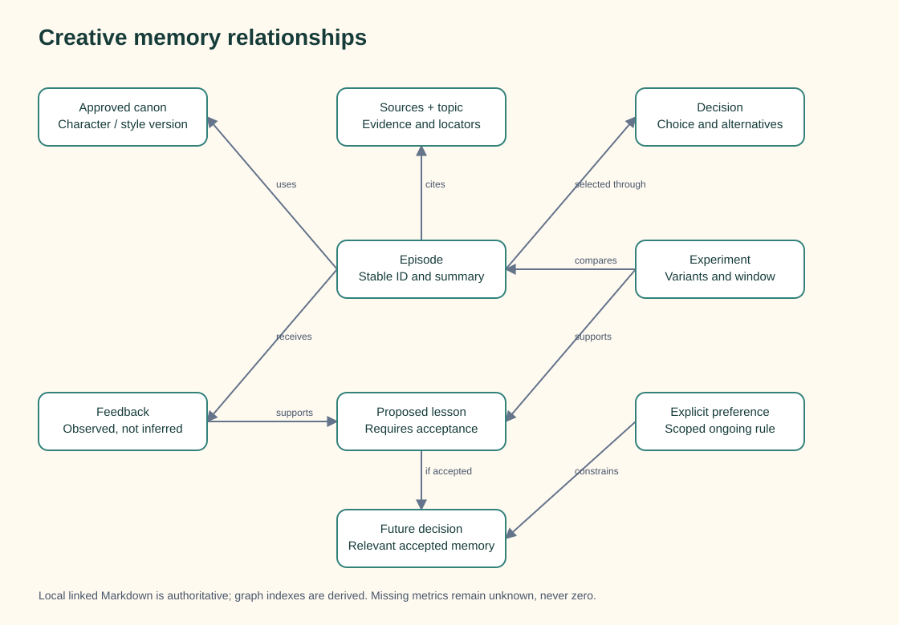

# Comic Studio architecture

The [production pipeline](production-pipeline.md) defines the active role contracts and evidence gates. Commands run from `framework/`; runtime episode work stays in ignored `../.local/episodes/`, while curated publications live in `../comics/`.

## Boundaries and current release

The system has two execution contexts. **Codex** runs the creative workflow and can invoke its built-in image tool. **Local utilities** manage files, render lettering, validate assets, and prepare exports. The CLI does not spawn Codex agents or call the built-in image tool. A future self-service web product needs its own supported execution backend, image-generation API integration, account isolation, and operating-cost controls.

This release provides local episode utilities, source capture, memory indexing/retrieval, Instagram-sized JPEG exports, documentation, and reusable production guidance. Detailed graphite references and the four-panel integrated compositor are available. Connected accounts, live publishing and scheduling remain future work. No visual studio UI is implemented. The diagrams combine executable utilities and Codex-directed creative steps; they do not describe an autonomous CLI service. `npm run demo` uses the historical logo as explicitly labelled sample artwork.

[Editable Mermaid source](diagrams/architecture.mmd). The SVG is a self-contained diagram equivalent of the Mermaid source, not a Mermaid-engine export.

## Agent ownership and handoffs

| Role | Receives | Returns |
|---|---|---|
| Producer | User input, stage state, relevant memory | Canonical episode files, tool invocations, final package |
| Researcher | Supplied sources and research question | Source brief, locators, uncertainty, unreadable inputs |
| Writer | Brief, approved canon, recent history, selected angle | Three angles, exact panel script, final publishing copy |
| Reviewer | Evidence, canon, script, rendered output | Specific findings, affected panel/claim, severity, pass/revise result |

These are Codex workflow roles. Independent specialist agents are used when the invoking task authorizes delegation and the environment supports it; instructions alone do not create running agents. Report unavailable independent review honestly rather than relabelling self-review.

Only the Producer writes canonical episode and memory records. Specialists return proposals and findings. The Reviewer receives source evidence and the actual deliverable without the Writer's self-assessment. Run specialists concurrently only when their inputs are independent; source briefing precedes factual scripting, and visual review follows rendering.

## Workflow and interfaces

[Editable Mermaid source](diagrams/workflow.mmd). SVG uses an equivalent simplified layout.

The durable unit is an episode directory. Its structured script owns episode identity, source references, selected angle, ordered panels, exact dialogue, actions, expressions, art paths, and layout. Generated artwork is an input to composition; it must not contain the final dialogue or branding. The renderer owns text, balloons, borders and footer (plus headers for legacy templates).

| Interface | Behaviour |
|---|---|
| `init <slug> --topic <text>` | Create episode workspace; return its location; do not claim content is generated |
| `select <episode-dir> <angle-id>` | Persist a choice from existing story options |
| `status <episode-dir>` | Print the stored episode JSON; use validation for structural and asset errors |
| `intake <episode-dir> <source-path-or-url>` | Capture bounded local text/PDF content and inventory images/URLs under a timestamped source directory |
| `validate <episode-dir>` | Check structural and asset requirements; return actionable failures |
| `render <episode-dir>` | Compose local art and exact script into editable SVG and PNG |
| `package <episode-dir>` | Bundle a current render with validated `copy.json`; keep the package marked `needs_review` |
| `publish <episode-dir> --platform … --dry-run` | Prepare/inspect the chosen destination; perform no external publication |

Exact field names and supported validators are defined by `scripts/studio.mjs`. Structural validation requires one to six panels, panel IDs, scene/alt text, at most two dialogue entries, valid speaker names, normalized speaker anchors, and local PNG/JPEG artwork. Render checks selection and text fit. Packaging checks required copy, its length constraints, and whether the render matches current content. Dry-run checks the package hashes and copy revision. None of these checks independently establishes factual or visual approval. There is no ready-promotion, metrics-import, live-publish, or scheduling command.

The implemented utilities persist angle selection, render paths, package paths, and status. Re-selecting the same angle is idempotent. Changing an existing choice archives the prior script, clears panels, and invalidates current render/package pointers while retaining old assets. Codex remains responsible for source briefing, writing, generation, and review progress. A text-only change can re-render existing artwork; publishing copy must be revised explicitly before packaging.

The intended creative review policy allows two script-revision rounds and two corrective image attempts per failed panel after the initial generation. Once exhausted, save a `needs review` draft with the unresolved finding. Code-validation failures and creative findings are separate records; subjective humour scores never establish audience demand.

## Memory and decisions

[Editable Mermaid source](diagrams/memory.mmd). SVG uses an equivalent simplified layout.

Use local Markdown notes with flat YAML metadata, stable identifiers, and explicit links. Obsidian is an optional reader/editor for these files; there is no required vault connection, community plugin, graph database, or vector database. The Python utility at `skills/comic-production/scripts/memory.py` builds a derived graph index, reports broken relationships, retrieves relevant records, and synchronizes the skill. Its JSON output is rebuildable; it does not import metrics or approve lessons automatically.

Keep sanitized approved canon and public episode summaries in tracked memory. Keep private feedback, experiments, conversational history and raw sources in ignored local runtime storage. Retrieve current approved canon, relevant preferences, ten recent episode summaries, and up to five older relevant episodes using tags, keywords, and explicit links.

Record decisions with the selected option, alternatives, reason, evidence, and superseding decision if any. A single rejected joke is not a global preference. Inferred lessons stay proposed until accepted; explicit ongoing user preferences can be recorded directly. No audience observation silently alters character canon.

Future performance records retain platform, measurement window, observation date, and raw counts. Unknown metrics remain unknown, never zero. Compare like platforms and windows; neither a graph edge nor a better-performing episode proves the cause of that performance. Do not store credentials, tokens, or private account authorization data in creative memory.

## Rendering and platform adaptation

The default `integrated-grid-v1` template produces a 2048×2048 master with exactly four square panels in two rows. Organic balloons contain editable dialogue at 85px (about 16.2px at 390px whole-page width); the original series footer uses smaller secondary credits. Artwork must reserve the upper balloon region. Measured overflow fails instead of shrinking the text. Legacy one-to-six-panel formats remain available when explicitly requested. Inspect the actual whole-page preview for expression, horn/face clearance, balloon tails and reading order; reference-guided generation can still drift.

The current package directory contains rendered strip/panels, editable SVGs, render metadata, transcript, alt text, `copy.json`, platform Markdown, Instagram JPEGs, and a hash manifest. Source brief, script, prompts, and review records remain episode-level workflow artifacts and are not automatically bundled. Copy is written in Codex, not generated by `package`. Substack body validation requires 250–400 words; LinkedIn requires 1,100–1,400 characters and two alternate hooks. Python/Pillow creates ordered 1080×1350 Instagram JPEGs by fitting each full panel onto a padded canvas without cropping. The Instagram dry-run references those JPEGs but performs no upload; connected-account eligibility and live API validation remain future work.

| Destination | Current boundary | Future integration |
|---|---|---|
| LinkedIn | Export and dry-run only | Official upload/Posts APIs after OAuth and application access are verified |
| Instagram | Export and dry-run only | Official publishing API after professional-account eligibility and permissions are verified |
| Substack | Prepared package and manual editor handoff | Assisted editor workflow; no documented public publishing API was established in planning |

Planning references: [LinkedIn access](https://learn.microsoft.com/en-us/linkedin/shared/authentication/getting-access), [LinkedIn Posts API](https://learn.microsoft.com/en-us/linkedin/marketing/community-management/shares/posts-api), [Meta Instagram documentation](https://www.postman.com/meta/instagram/documentation/6yqw8pt/instagram-api), and [Substack publishing](https://support.substack.com/hc/en-us/articles/360037831771-How-do-I-publish-a-new-post-on-Substack). Revalidate permissions and supported formats during adapter implementation; these links are not proof of this application's access.

Live publishing will use conventional job handling: exact content revision, selected account identity, per-destination status, idempotency, bounded retries, and returned post IDs/URLs. A timeout with uncertain outcome must trigger reconciliation before another post attempt. Success on one platform must not be repeated when another fails. Scheduling, credentials, OAuth tokens, and publishing jobs belong in operational storage, not the memory graph.

## Verification and roadmap

Test invalid panel counts, missing art, transcript mismatch, text overflow, angle persistence, interrupted runs, targeted revisions, per-panel retries, duplicate prevention, and dry-run side-effect freedom. Memory tests should cover broken links, superseded rules, one-off feedback, and absent metrics. Exercise the default four-panel template with actual artwork and review identity and phone readability manually. Use legacy layouts only where explicitly required.

1. **Local foundation:** episode utilities, skill guidance, documentation, renderer, exports, and dry runs.
2. **Creative verification:** produce reviewed episodes using the current series references, record repair findings, and validate repeatability.
3. **Demo release:** prove the complete production sequence and one verified live publishing integration; keep other destinations explicitly labelled handoffs or dry runs.
4. **Creator release:** connected LinkedIn/Instagram accounts, Substack handoff, scheduling, and publication history.
5. **Public product:** separate execution backend, multiple creators, isolated accounts/memory, usage controls, and operational monitoring.
